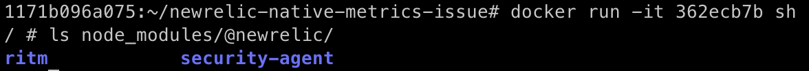
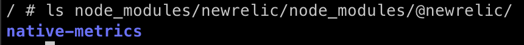

# newrelic-native-metrics-issue

Example repository for `newrelic` [issue](https://github.com/newrelic/node-newrelic/issues/2445)

## Steps to reproduce

Using `newrelic` v12.0.0 and `@newrelic/native-metrics` v11.0.0

1. Clone repository branch `main`
2. Use a NOT arm64 device
3. Execute `docker build .`
4. Run the container with `sh` : `docker run -it <id> sh`
5. List the content of the folder `node_modules/@newrelic`
6. `native-metrics` is NOT there

Using `newrelic` v11.23.2 and `@newrelic/native-metrics` v10.0.1

1. Switch to branch `newrelic-v11.23.2`
2. Reproduce previous steps 2 to 4
3. List the content of the folder `node_modules/newrelic/node_modules/@newrelic` => here because the version is overrided in the package.json to force v10.0.1
4. `native-metrics` is there
